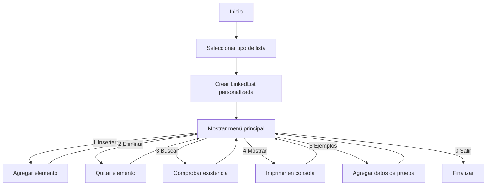

# Actividad_2-ED
Actividad 2 de la Materia de Estructura de Datos

Este proyecto implementa una **clase genérica `LinkedList`** que simula el comportamiento de tres tipos de listas enlazadas en Java:

- ✅ **Lista simplemente enlazada** → Cada nodo apunta al siguiente.  
- ✅ **Lista doblemente enlazada** → Cada nodo apunta al anterior y al siguiente.  
- ✅ **Lista circular** → El último nodo se conecta con el primero.  

El programa incluye un **menú interactivo** para:
- Insertar datos.
- Eliminar datos.
- Buscar datos.
- Mostrar todos los elementos.
- Insertar ejemplos automáticamente (`DataTypeExamples`).

Es útil para **aprender estructuras de datos** y practicar con **listas enlazadas** en Java.


## 🚀 Tecnologías utilizadas
- **Java (JDK 8 o superior)**
- **Scanner** → Lectura de datos del usuario.
- **LinkedList (implementación personalizada)**.
- **DataTypeExamples** → Inserta datos de prueba automáticamente.


## 📂 Estructura del programa

### **1️⃣ Selección del tipo de lista**
Al iniciar, se pide elegir el tipo de lista:

```java
System.out.println("--- Selecciona el tipo de lista ---");
System.out.println("1. Simplemente enlazada");
System.out.println("2. Doblemente enlazada");
System.out.println("3. Circular");
````

Según tu elección, se crea la lista:

```java
if (tipo == 1) lista = new LinkedList<>(false, false);
else if (tipo == 2) lista = new LinkedList<>(true, false);
else lista = new LinkedList<>(false, true);
```

* Primer parámetro: `true` si es doblemente enlazada.
* Segundo parámetro: `true` si es circular.
* Por defecto: lista simplemente enlazada.

---

### **2️⃣ Menú interactivo**

Después de elegir la lista aparece el menú:

```
--- Menú ---
1. Insertar dato
2. Eliminar dato
3. Buscar dato
4. Mostrar lista
5. Insertar ejemplos de DataTypeExamples
0. Salir
```

Este menú se repite hasta seleccionar **0 (Salir)**.

---

### **3️⃣ Funcionalidades principales**

| Opción | Funcionalidad     | Descripción                              |
| ------ | ----------------- | ---------------------------------------- |
| 1      | Insertar dato     | Agrega un valor al final de la lista.    |
| 2      | Eliminar dato     | Solicita un valor y lo borra si existe.  |
| 3      | Buscar dato       | Verifica si un valor está en la lista.   |
| 4      | Mostrar lista     | Imprime todos los elementos.             |
| 5      | Insertar ejemplos | Inserta datos de prueba automáticamente. |
| 0      | Salir             | Termina el programa.                     |

---

### 🔄 Flujo de ejecución (diagrama)



---

## ⚙️ Ejecución

### 🔹 En Windows (PowerShell)

1. Abrir PowerShell y situarse en la carpeta del proyecto.
2. Ejecutar el script incluido (`run.ps1`) para compilar y correr la demo principal (`OSManagementDemo`):

```powershell
.\run.ps1
```

> El script usa `javac --release 8` y luego ejecuta `OSManagementDemo`.

3. Ejecutar pruebas ligeras (`Pila` y `Cola`):

```powershell
javac --release 8 *.java
java StackQueueTests
```

---

### 🔹 En cualquier sistema (manual)

1. Compilar:

```bash
javac Main.java
```

2. Ejecutar:

```bash
java Main
```

---

## 📦 Archivos añadidos en esta entrega

* `run.ps1` → Script PowerShell para compilar y ejecutar la demo.
* `StackQueueTests.java` → Pruebas básicas de `Pila` y `Cola`.
* `.gitignore` → Excluye archivos compilados (`*.class`).

---

## 📌 Notas importantes

* La clase `LinkedList` es **implementación propia**, no la de `java.util`.
* Si no ingresas nada válido, se usa **lista simplemente enlazada por defecto**.
* El menú es **interactivo** y se repite hasta elegir **Salir (0)**.


