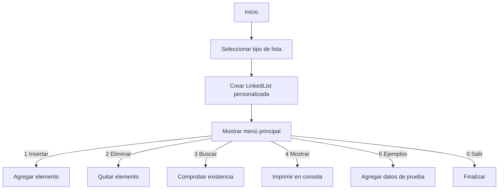

# Actividad 2 – Estructura de Datos

Este proyecto corresponde a la **Actividad 2** de la materia de **Estructura de Datos**.  
Implementa diferentes tipos de **listas enlazadas** (simple, doble y circular) y, a partir de ellas, estructuras derivadas como **pilas** y **colas**.

---

## 🎯 Objetivo

El objetivo de este proyecto es **comprender e implementar manualmente** estructuras lineales clásicas, comparando su funcionamiento y eficiencia frente a la librería estándar de Java.  


---

## 📂 Estructura del proyecto

```

├── LinkedList.java        # Clase genérica para listas enlazadas
├── Node.java              # Nodo que almacena valor y referencias
├── Pila.java              # Implementación de pila (LIFO) con LinkedList
├── Cola.java              # Implementación de cola (FIFO) con LinkedList
├── DataTypeExamples.java  # Inserta datos de prueba
├── Main.java              # Menú principal interactivo
├── OSManagementDemo.java  # Demo tipo gestor de procesos/colas
├── StackQueueTests.java   # Pruebas de pila y cola
├── run.ps1                # Script de compilación/ejecución en Windows
└── README.md

````

> 💡 Sugerencia: se recomienda ejecutar el proyecto dentro de un IDE (IntelliJ, Eclipse, VS Code con extensión Java) para mayor comodidad.

---

## 📝 Descripción general del programa

El programa es una aplicación de consola que permite crear y manipular listas enlazadas personalizadas.
Su objetivo es mostrar de manera práctica cómo funcionan las listas simplemente enlazadas, doblemente enlazadas y circulares, además de demostrar cómo a partir de ellas se pueden construir otras estructuras de datos como pilas (LIFO) y colas (FIFO).

A través de un menú interactivo, el usuario puede:

- Insertar, eliminar y buscar elementos en la lista.
- Visualizar los elementos almacenados.
- Insertar datos de ejemplo automáticamente para realizar pruebas rápidas.

De esta manera, el proyecto no solo implementa las estructuras, sino que también ofrece un entorno para experimentar con sus operaciones básicas, analizar sus diferencias y comprender la eficiencia de cada variante.

---

## ⚙️ Requisitos

- **Java JDK 8** o superior (probado con JDK 17).  
- PowerShell (Windows) o terminal Bash (Linux/macOS).  

---

## ⚙️ Tecnologías utilizadas
- Java (JDK 8 o superior)
- Scanner → Lectura de datos del usuario.
- LinkedList (implementación personalizada).
- DataTypeExamples → Inserta datos de prueba automáticamente.

---

## 🚀 Ejecución

### En Windows (PowerShell)
```powershell
.\run.ps1
````

Este script compila y ejecuta la clase `OSManagementDemo`.

### En Linux/macOS

```bash
javac --release 8 *.java
java Main
```

---

## 📖 Uso

Al ejecutar el programa, se solicita elegir el **tipo de lista enlazada**:

* Lista simplemente enlazada
* Lista doblemente enlazada
* Lista circular

Luego se muestra un menú interactivo:

| *Opción* | *Funcionalidad* | *Descripción*                                                       |
| ---------- | ----------------- | --------------------------------------------------------------------- |
| *1*      | Insertar dato     | Pide un valor y lo agrega al final de la lista.                       |
| *2*      | Eliminar dato     | Solicita un valor y lo borra si existe.                               |
| *3*      | Buscar dato       | Verifica si un valor está en la lista.                                |
| *4*      | Mostrar lista     | Imprime todos los elementos de la lista.                              |
| *5*      | Insertar ejemplos | Inserta automáticamente datos predefinidos usando DataTypeExamples. |
| *0*      | Salir             | Termina el programa.                                                  |


Ejemplo de salida en consola:

```
Seleccione tipo de lista:
1. Simple
2. Doble
3. Circular
> 1
Lista simplemente enlazada creada.
Menú principal:
1. Insertar dato
2. Eliminar dato
3. Buscar dato
4. Mostrar lista
5. Insertar ejemplos
0. Salir
```

---

## 🧩 API esencial

### LinkedList\<T>

| Método        | Descripción                                     |
| ------------- | ----------------------------------------------- |
| `add(T val)`  | Inserta un elemento al final                    |
| `remove(T v)` | Elimina el primer elemento igual a `v`          |
| `contains(v)` | Devuelve `true` si el elemento está en la lista |
| `size()`      | Número de elementos                             |
| `isEmpty()`   | Devuelve `true` si está vacía                   |
| `clear()`     | Elimina todos los elementos                     |

### Pila\<T>

| Método    | Descripción                 |
| --------- | --------------------------- |
| `push(v)` | Inserta elemento en la pila |
| `pop()`   | Extrae el último elemento   |
| `peek()`  | Consulta el último elemento |

### Cola\<T>

| Método       | Descripción                 |
| ------------ | --------------------------- |
| `enqueue(v)` | Inserta elemento en la cola |
| `dequeue()`  | Extrae el primer elemento   |
| `peek()`     | Consulta el primer elemento |

---

## ⏱️ Complejidad

| Operación             | Lista simple | Lista doble | Lista circular |
| --------------------- | ------------ | ----------- | -------------- |
| Inserción al inicio   | O(1)         | O(1)        | O(1)           |
| Inserción al final    | O(n)         | O(1)        | O(1)           |
| Eliminación al inicio | O(1)         | O(1)        | O(1)           |
| Eliminación al final  | O(n)         | O(1)        | O(1)           |
| Búsqueda por valor    | O(n)         | O(n)        | O(n)           |

---

## 🔄 Diagrama de flujo



---

## 🧪 Pruebas

El archivo `StackQueueTests.java` incluye pruebas simples de pila y cola.
Se recomienda migrarlas a **JUnit 5** para validaciones automáticas.

Ejemplo de prueba manual esperada:

```
Push → 1, 2, 3
Pop → 3
Peek → 2
```

---

## 📌 Limitaciones conocidas

* No es **thread-safe**.
* No incluye **iteradores** ni acceso por índice (`get(i)`).
* Las pruebas son manuales y limitadas.

---


## ✨ Autores

* Erick Mauricio Santiago Díaz (@Erick-MSD)
* Josué David Murillo Gómez (@Josuemgd15)
* Santiago Sebastian Rojo Marquez (@Sanlaan)
* Daniel Isai Sanchez Guadarrama (@DanielIsaiSG)

```
